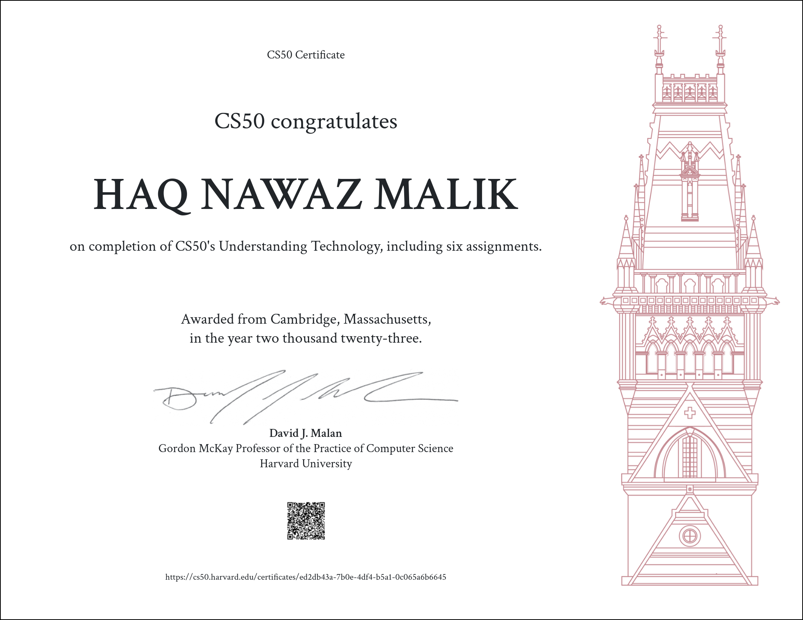

## About CS50-T

This course is for students who don’t (yet) consider themselves computer persons. Designed for students who work with technology every day but don’t necessarily understand how it all works underneath the hood or how to solve problems when something goes wrong, this course fills in the gaps, empowering students to use and troubleshoot technology more effectively. Through lectures on hardware, the Internet, multimedia, security, programming, and web development as well as through readings on current events, this course equips students for today’s technology and prepares them for tomorrow’s as well.

**Attention: All CS50T assignments and projects are to be submitted to the Harvard Google portal. 

  

*Please note that this repository is for storing my projects and files from Harvard University's CS50x course. It is not meant for sharing answers or encouraging academic dishonesty. If you are currently enrolled, please complete the assignments independently and refer to the course materials.*

